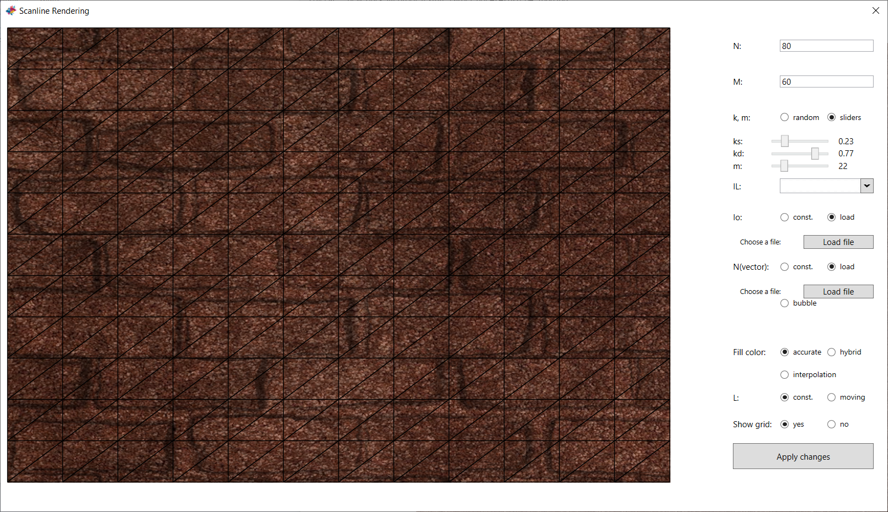

# ScanlineRendering
ScanlineRendering is a program written in WPF technology implementing Scanline fill algorithm on a grid of triangles.
It allows user to apply a texture and a normal map, change light position/color and triangle's parameters for realistic effects.

## Options
1. "N: " - width of a single triangle
2. "M: " - height of a single triangle
3. "k, m: " - radiobuttons (random - random values for each triangle, sliders - show 3 sliders for ks, kd i m)
4. "IL: " - light's color (retractable list of colors)
5. "Io: " - object's texture (const. - constant color picked from retractable list of colors, load - possibility to choose a file with texture with the button 'Load file')
6. "N(vector): " - normal map (const. - constant vector (0,0,1) in each point of the texture, load - possibility to choose a file with normal map with the button 'Load file')
7. "Fill color: " - method of filling triangles - accurate, hybrid and interpolated
8. "L: " - vector of light source (const. - constant (0,0,1) in each point, moving - the light source is moving every 100ms by angle 5 on a sphere)
9. "Show grid: " - possibility to show/hide grid of triangles
10. "Apply changes" - a button used to save actual options; no changes are visible units it's used

## Releases
[All releases](https://github.com/martalech/ScanlineRendering/releases)

## About Project
Written with Visual Studio 2017 with .NET Framework 4.7.2.
